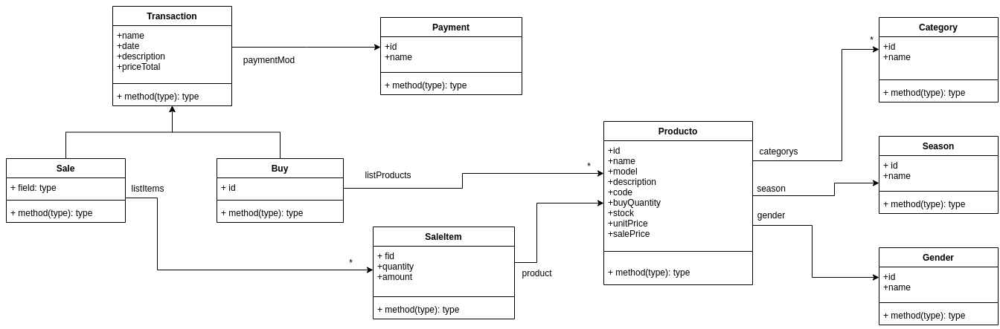

## Citrino

ABM de Articulos (Product) donde el usuario Administra el stock de productos atravez de funciones(transacciones) realizando

***comprar(buy)***    y/o   ***vender(sale)***

ademas de las funciones de reportes y paginacion 

#### UML

plataforma BackEnd API REST de compra, venta y administracion de stock con **symfony 4**, fosrestbundle ,doctrine ORM 
